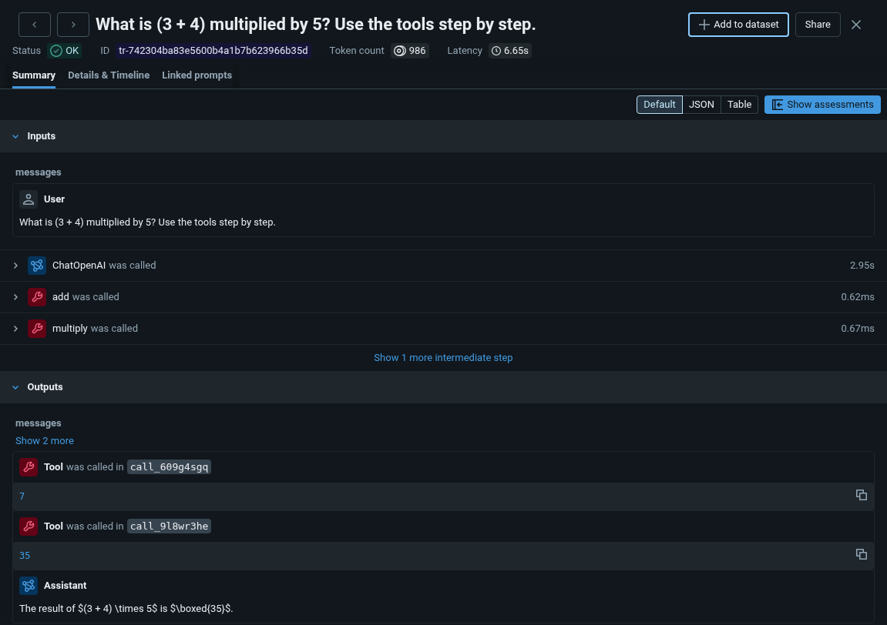

# Teach MLflow — from beginner to advanced

[](https://github.com/argythana/teach-mlflow/actions/workflows/notebooks.yml?query=branch%3Amain)

Tutorials and teaching material for MLflow, aimed at researchers and data scientists who
know Python and ML but are new to tracking servers, model serving, and MLOps.

MLflow has evolved rapidly and gained wide adoption. Since version 3 it has grown into a
platform for tracking both traditional ML experiments and modern AI / LLM workflows.

Most ML courses, meanwhile, teach algorithms and their metrics as standalone topics and
skip the reproducibility, observability, and monitoring that scientific research and
production ML systems depend on.

MLflow is not taught at any Computer Science university in Greece, even though it is
essential for data scientists. The goal of this repo is to provide beginner-friendly,
up-to-date learning resources that help fill that gap.

## The tutorials

Notebooks are grouped by track. Each folder is prefixed `a_`, `b_`, `c_`, … so the
intended reading order is obvious from `ls`. Each one stays close to the official MLflow
material but adds the prerequisites, terminology, and "why this feature exists" context
the upstream docs assume or skip.

**`basics/` — shared foundations** (local server on port `5000`), the starting point for
either track:

- `a_setup_mlflow` — what MLflow solves; `mlflow ui` vs `mlflow server`; connecting a
  notebook to a tracking server.
- `b_tracking_quickstart` — log a model, parameters, and metrics; the three stores
  (backend / artifact / registry); loading a model back as a `pyfunc`.

**`ml/` — traditional-ML track** (local server on port `5001`):

- `a_model_logging` — logging scikit-learn models well: safe serialization with `skops`,
  and the one-line `mlflow.sklearn.autolog()`.
- `b_hyperparameter_tuning` — an Optuna sweep with parent/child runs, and a first look
  at the model registry.
- `c_logging_plots` — log EDA and diagnostic figures across a sweep with
  `mlflow.log_figure`.
- `d_logging_callbacks` — XGBoost + Optuna callbacks; parent-run metric history vs
  stdout heartbeats.
- `e_model_evaluation` — `mlflow.models.evaluate()`, custom metrics, and validation
  gates (CI for models).
- `f_model_registry` — versions, `@champion` / `@challenger` aliases, the promotion
  lifecycle, and rollback.
- `g_model_serving` — serve a registered model over REST with `mlflow models serve`; the
  `/invocations` contract, signature enforcement, and the container path.
- `h_dataset_logging` — `mlflow.data` + `log_input` for dataset lineage (raw vs
  engineered features, digests).
- `i_system_metrics` — `system/*` resource observability (CPU / RAM / GPU) under a heavy
  training load.
- `j_capstone_end_to_end` — one model through the full lifecycle: feature-engineer →
  tune → evaluate → gate → register → serve.

Together these form the traditional-ML MLOps spine (tracking → evaluation → registry →
serving).

**`gen_ai/` — GenAI / LLM track** (local server on port `5001`, plus a local
[Ollama](https://ollama.com) model): tracing, LLM-as-judge evaluation, the prompt
registry, serving, and feedback and monitoring — where the MLflow **Traces** tab lights
up. The whole track runs **fully local on `gemma3:4b`** by default (zero cost, no API
key); where a stronger hosted model would help, the notebook shows the swap as an
optional step. See [GenAI track prerequisites](#genai-track-prerequisites).

- `a_tracing_quickstart` — automatic and manual tracing (`mlflow.openai.autolog()`,
  `@mlflow.trace`) against a local Ollama model; spans, traces, and the Traces tab.
- `b_tracing_a_multistep_app` — a hand-built RAG pipeline with nested retriever / chain
  / LLM spans, and how the trace shows which step produced a bad answer.
- `c_genai_evaluation` — `mlflow.genai.evaluate()` with built-in and custom LLM-as-judge
  scorers, using a local judge (`ollama:/gemma3:4b`).
- `d_langchain_agent` — a tool-using LangChain agent traced by the one-line
  `mlflow.langchain.autolog()` (uses `qwen3:1.7b`, a model that can call tools).
- `e_prompt_registry` — register, version, and alias prompts, then promote the version
  the `c_` judge prefers.
- `f_genai_app_serving` — log a GenAI app with models-from-code and serve it over REST
  on port `5002`; prompt promotions reach the endpoint with no redeploy.
- `g_feedback_and_monitoring` — human and code feedback on traces (`log_feedback`), and
  LLM-judge monitoring over `search_traces`.
- `h_dspy_optimization` — (advanced) a DSPy optimizer improves a prompt against a metric
  while `mlflow.dspy.autolog()` records each compile.
- `i_rag_capstone` — the finale: local `nomic-embed-text` embeddings, a Milvus Lite
  index, and a LlamaIndex query engine, traced, evaluated, prompt-versioned, and
  monitored; its serving step points back to `f_`.



See `roadmap/` for the design decisions behind each track and what is planned next.

## Start the MLflow tracking server first

Every notebook assumes a local MLflow tracking server is already running. **Before
opening a notebook**, start it in a separate terminal from the `src/` folder, on the
port that notebook expects — the `basics/` notebooks use `5000`; the `ml/` and `gen_ai/`
tracks use `5001`:

```bash
cd src/
mlflow ui --host 127.0.0.1 --port 5000   # use 5001 for the ml/ and gen_ai/ tracks
```

Leave it running and open the UI at the matching address (e.g. <http://127.0.0.1:5000>).
In MLflow 3 this creates a `mlflow.db` (the SQLite backend store) and an `mlartifacts/`
directory in the folder you started the server from. Start it from `src/` every time so
they stay in one place, next to the notebooks; the notebooks' on-disk examples assume
that layout. Both are per-developer runtime state and are gitignored.

If a notebook cell calls `mlflow.set_tracking_uri("http://127.0.0.1:<port>")` while no
server is listening on that port, the logging calls will fail.

## Setup

Requires Python **3.14** and [`uv`](https://docs.astral.sh/uv/) for dependency
management.

```bash
uv sync          # creates .venv/ and installs locked dependencies
```

`direnv` auto-activates the venv via `.envrc`; otherwise `source .venv/bin/activate`.

## GenAI track prerequisites

The `gen_ai/` notebooks call a language model, so they need more than the tracking
server. Everything they need runs locally and for free.

**Ollama** is a local model runtime — a **system install, not a Python dependency**
(`uv sync` does not install it). Install it once, then pull the models the track uses:

- **macOS / Windows:** download the installer from
  [ollama.com/download](https://ollama.com/download).
- **Linux:** `curl -fsSL https://ollama.com/install.sh | sh`.

```bash
ollama pull gemma3:4b         # the default: generation and the LLM-as-judge, every notebook
ollama pull qwen3:1.7b        # d_langchain_agent only: it needs a model that can call tools
ollama pull nomic-embed-text  # i_rag_capstone only: the embedding model for the RAG index
```

Ollama serves on `http://localhost:11434`; the notebooks reach it through the `openai`
client (no API key). It normally runs in the background after install — if a notebook
fails with a connection error to that address, start it with `ollama serve`.
[`src/setup/a_ollama_setup.ipynb`](src/setup/a_ollama_setup.ipynb) walks through the
install, the checks, choosing a model size for your machine, and troubleshooting. The
`basics/` and `ml/` tracks don't need Ollama.

**Optional: a hosted model.** A small local model is enough to learn MLflow, but a
stronger hosted model gives better answers and a more reliable judge. The notebooks show
the swap as an optional step: `a_tracing_quickstart` has an OpenAI swap and an Azure
OpenAI section, `c_genai_evaluation` an optional hosted-judge cell, and
`d_langchain_agent`, `h_dspy_optimization` and `i_rag_capstone` a commented-out Azure
configuration. Each is skipped or inert unless you set the credentials. For Azure, put
them in a `.env` file at the repo root — `.env` is gitignored, and the notebooks load it
with `python-dotenv`:

```bash
# .env at the repo root (gitignored; never commit real values)
AZURE_OPENAI_API_KEY=<your-api-key>
AZURE_OPENAI_BASE_URL=https://<your-resource>.openai.azure.com
AZURE_OPENAI_API_VERSION=2024-10-21                        # optional
AZURE_OPENAI_LIGHT_MODEL=<your-chat-deployment-name>
AZURE_OPENAI_EMBED_MODEL=<your-embedding-deployment-name>  # i_rag_capstone only
```

## References

- [MLflow documentation](https://mlflow.org/docs/latest/index.html)
- [MLflow GitHub](https://github.com/mlflow/mlflow)

## License

The code in this repository, including the notebooks' code cells, is licensed under the
[MIT License](LICENSE). The tutorial prose, in the Markdown files and the notebooks'
text cells, is licensed under
[Creative Commons Attribution 4.0 International (CC BY 4.0)](LICENSE-CC-BY-4.0.txt). If
you reuse the prose, credit it with this line and say whether you changed it:
"[teach-mlflow](https://github.com/argythana/teach-mlflow) by Thanasis Argyriou,
licensed under [CC BY 4.0](https://creativecommons.org/licenses/by/4.0/)."
